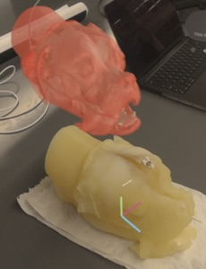

# AR Surgery (VisionOS)

Interactive Surgical guidance prototype for Apple Vision Pro built with SwiftUI, RealityKit and ARKit. This app renders a patient/phantom model in an Immersive Space, aligns it to the real world, and overlays guidance visuals.

## Object Tracking

Recognizes the Phantom in the real-world and attaches a virtual model (Virtual Phantom) to it in the immersive space.
